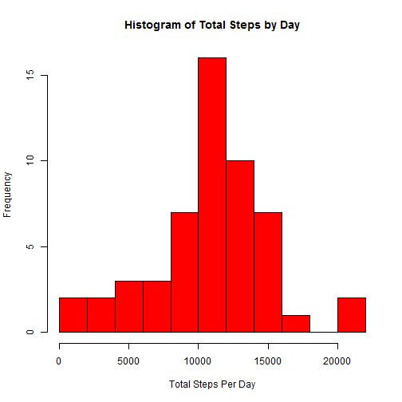
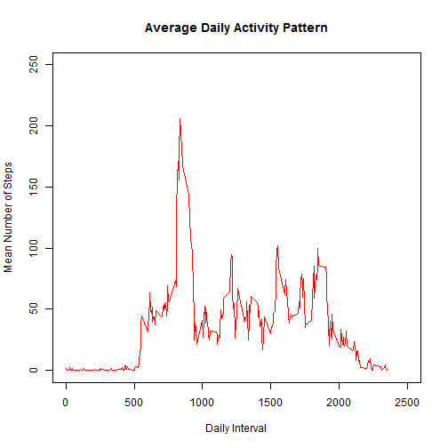
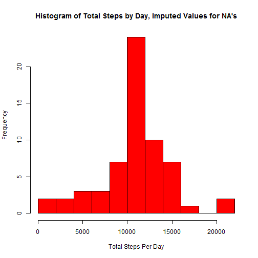

**Reproducible Research Proramming Assignment 1**


**Loading and Preprocessing the Data**


```r
data<-read.csv("C:/Users/kris/Documents/activitymonitoringdata.csv")
data$date<-as.Date(data$date, "%m/%d/%Y")
data$steps<-as.numeric(data$steps)
imputeddata<-data
library(knitr)
```


**Mean Total Number of Steps Taken Per Day**


```r
totstepsperday<-aggregate(data$steps, list(data$date), sum)
hist(totstepsperday$x, breaks=10, col="red", main="Histogram of Total Steps by Day", xlab="Total Steps Per Day", ylab="Frequency")
```

 

```r
meanstepsperday<-mean(totstepsperday$x, na.rm=TRUE)
medianstepsperday<-median(totstepsperday$x, na.rm=TRUE)
```

The mean number of steps per day is 1.0766189 &times; 10<sup>4</sup>.
The median number of steps per day is 1.0765 &times; 10<sup>4</sup>.


**Average Daily Activity Pattern**


```r
totstepsperinterval<-data.frame()
totstepsperinterval<-aggregate(data$steps, list(data$interval), sum, na.rm=TRUE)
meanstepsperinterval<-aggregate(data$steps, list(data$interval), mean, na.rm=TRUE)
plot(meanstepsperinterval$Group.1, meanstepsperinterval$x, type="l", col="red", main="Average Daily Activity Pattern", xlab="Daily Interval", ylab="Mean Number of Steps", xlim=c(0,2500), ylim=c(0, 250))
```

 

```r
maxintervalsteps<-max(meanstepsperinterval$x)
maxcounter<-which.max(meanstepsperinterval$x)
maxintervalvalue<-meanstepsperinterval$Group.1[maxcounter]
```

The maximum number of mean steps per interval is 206.1698113.
The maximum occurs in interval 835.


**Imputing Missing Data**


```r
nummissingrows<-sum(is.na(data$steps))
```

The number of missing values in the dataset is 2304.

We will impute the missing data by substituting the mean for that particular interval across all days for all NA values.


```r
for (i in 1:nrow(data)) {
    if (is.na(data$steps[i])) {
        intervalcounter<-data$interval[i]
        indx<-which(meanstepsperinterval$Group.1==intervalcounter)
        imputeddata$steps[i] <- meanstepsperinterval$x[indx]
  }
}

totimputedstepsperday<-aggregate(imputeddata$steps, list(imputeddata$date), sum)
hist(totimputedstepsperday$x, breaks=10, col="red", main="Histogram of Total Steps by Day, Imputed Values for NA's", xlab="Total Steps Per Day", ylab="Frequency")
```

 

```r
meanimputedstepsperday<-mean(totimputedstepsperday$x, na.rm=TRUE)
medianimputedstepsperday<-median(totimputedstepsperday$x, na.rm=TRUE)
```

The mean number of steps per day, with imputed values for NA's, is 1.0766189 &times; 10<sup>4</sup>.
The median number of steps per day, with imputed values for NA's, is 1.0766189 &times; 10<sup>4</sup>.

The mean number of steps per day is the same.  This makes sense because the NA values are concentrated within entire days.  Thus, when all of the NA's are replaced with the mean value for that interval, the result is that the full day will have a total steps equal to the previous overall mean steps per day, and the overall mean steps per day will remain the same.

The median has moved up slightly to be equal to the mean steps per day.  This makes sense because there are now 8 days with a total equal to the mean steps per day, and the middle/median value will be equal to that value.  This is reflected in the revised histogram, which shows the greater frequency in the middle bar.


**Are There Activity Differences Between Weekdays and Weekends?**


```r
library(timeDate)
newdata<-data.frame()
newdata<-data
newdata$dayofweek<-weekdays(newdata$date)
weekdy<-c("Monday", "Tuesday", "Wednesday", "Thursday", "Friday")
wkend<-c("Saturday", "Sunday")
newdata$typeday <- factor((newdata$dayofweek %in% weekdy), levels=c(FALSE, TRUE), labels=c('weekend', 'weekday'))
wknddata<-subset(newdata, newdata$typeday=="weekend")
wkdydata<-subset(newdata, newdata$typeday=="weekday")
wkndmeanstepsperinterval<-aggregate(wknddata$steps, list(wknddata$interval), mean, na.rm=TRUE)
wkdymeanstepsperinterval<-aggregate(wkdydata$steps, list(wkdydata$interval), mean, na.rm=TRUE)
par(mfrow=c(2,1))
plot(wkndmeanstepsperinterval$Group.1, wkndmeanstepsperinterval$x, type="l", col="blue", main="Weekend", xlab="Interval", ylab="Number of Steps", xlim=c(0,2500), ylim=c(0, 250))
plot(wkdymeanstepsperinterval$Group.1, wkdymeanstepsperinterval$x, type="l", col="blue", main="Weekday", xlab="Interval", ylab="Number of Steps", xlim=c(0,2500), ylim=c(0, 250))
```

 

There do appear to be activity differences between weekdays and weekends.  There appear to be more steps in the 8AM-9AM and 6PM - 7PM ranges on weekdays, when the individual may be commuting to and from work.  In general, there appear to be more steps during "work hours" of 9AM - 6PM on the weekends.  This may reflect the fact that the individual is largely seated at a desk during these hours on weekdays, but more active on the weekends.


